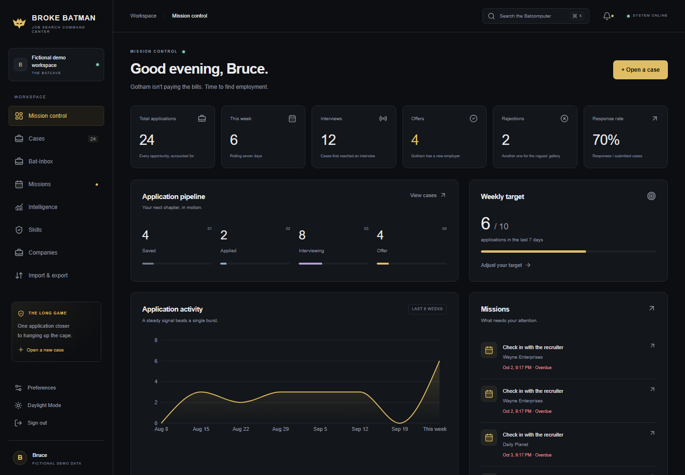
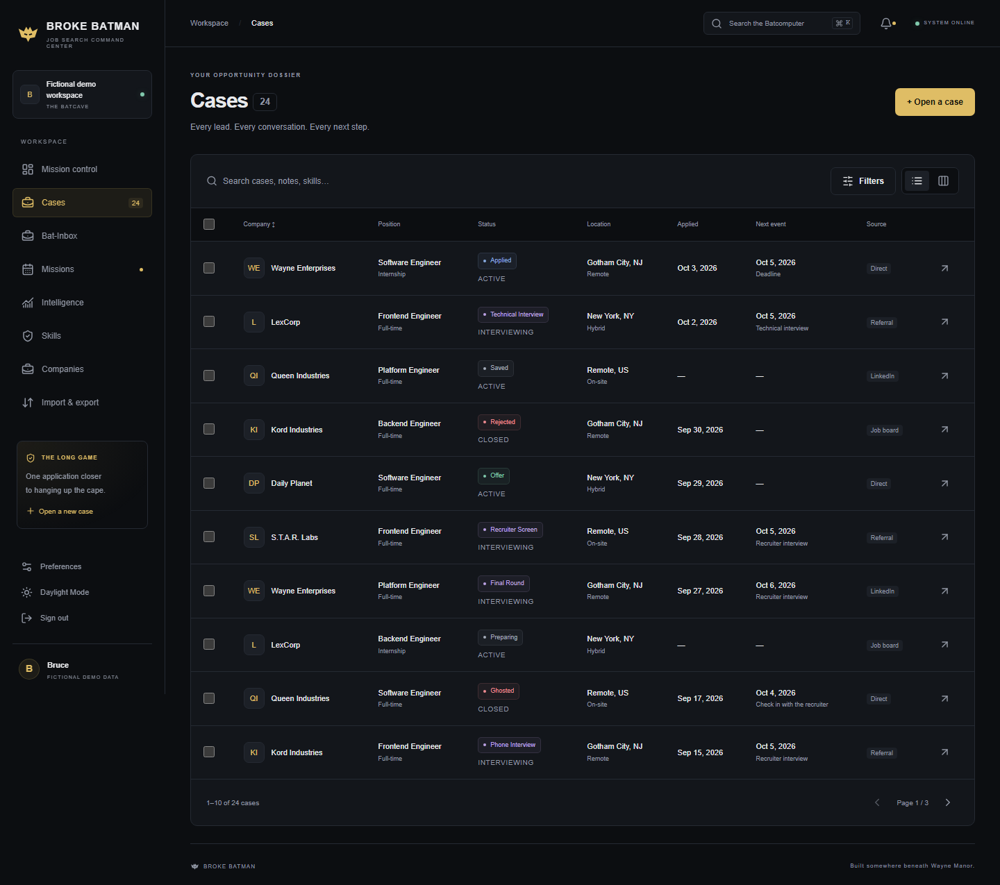
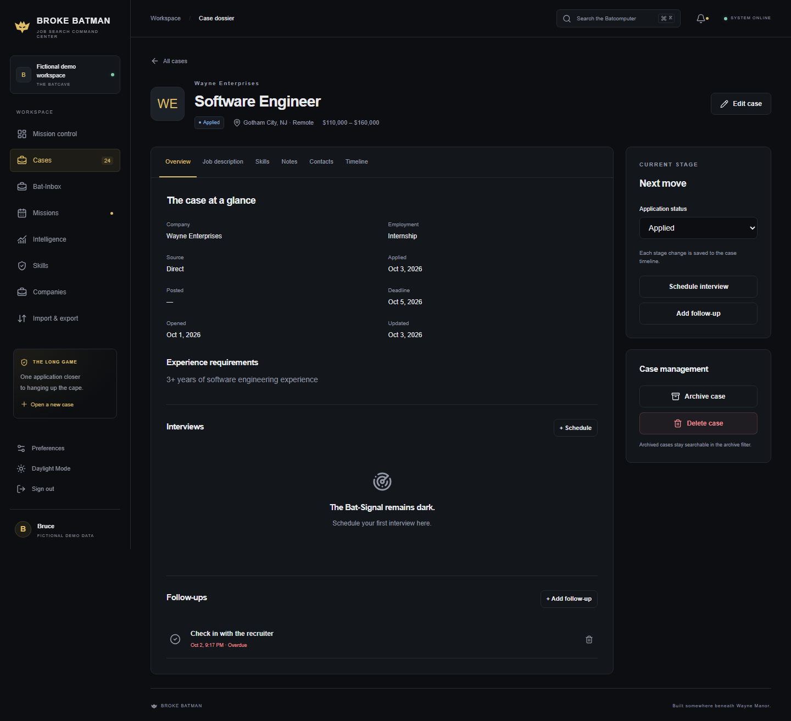
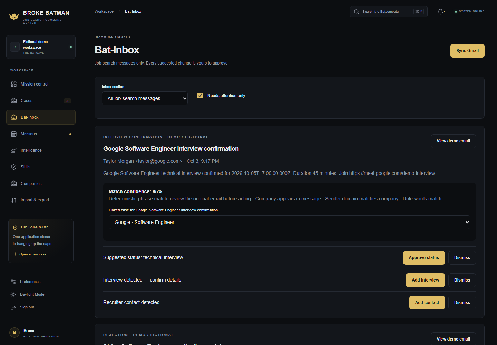
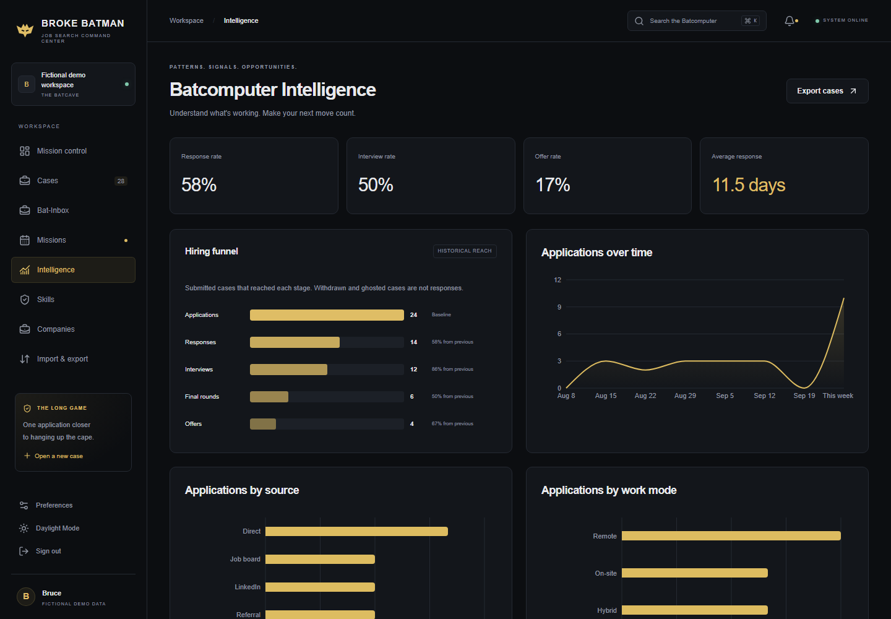
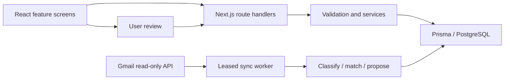

# Broke Batman

> Gotham isn't paying the bills.

The Batmobile needs gas. Wayne Manor has property taxes. Alfred would like to see a stable income.

So Batman is applying for software engineering jobs.

**Broke Batman** keeps applications, interviews, recruiter emails, and follow-ups in one place. The presentation is a joke. The PostgreSQL transactions, OAuth integration, and hiring analytics are actual engineering.

## Why build this?

A job search quickly becomes a spreadsheet, a calendar, and an inbox that disagree with each other. I wanted a project with more interesting problems than another CRUD dashboard: messy input, uncertain matches, outside services, and automation that needs to know when to stop.

## Screenshots

**Mission control**



<details>
<summary>Cases, case details, Bat-Inbox, and Batcomputer Intelligence</summary>






</details>

## What it does

- **Cases:** searchable, filtered tables and Kanban; status history, notes, contacts, duplicate warnings, archive/restore, and bulk actions.
- **Job postings:** paste text or fetch a public job URL; review extracted requirements, salary, and skills before saving. Local parsing works without an AI key.
- **Bat-Inbox:** Gmail read-only OAuth, queued sync, classification, evidence-based case matching, and approval of suggested changes. A fictional inbox exercises the same ingestion pipeline.
- **Missions:** interviews, deadlines, and follow-ups with timezone-aware display and completion controls.
- **Batcomputer Intelligence:** historical funnel, source conversion, observed response times, weekly comparisons, company signals, activity, and streaks.
- **Skills:** proficiency profile, normalized aliases, required/preferred skills, and an explained match score. It does not predict hiring outcomes.
- **Everyday controls:** notifications, Ctrl/Cmd+K search, CSV preview/import/export, JSON backup, and persistent dark/daylight themes.

## The fun stuff

Cases at Wayne Enterprises, LexCorp, and the Daily Planet. A tiny Wayne Manor footer. A familiar ten-key sequence that says “I'm Batman.” Alfred recommends sunlight after a seven-day streak.

The geometric vigilante mark is original. The controls still say what they do.

## Architecture



One Next.js application and one optional mail worker share PostgreSQL. No separate queue infrastructure. [Architecture](docs/ARCHITECTURE.md), [database](docs/DATABASE.md), and [email pipeline](docs/EMAIL_INTELLIGENCE.md) explain the boundaries and tradeoffs.

**Stack:** Next.js 16 App Router, React 19, TypeScript, Prisma, PostgreSQL, Zod, jose, bcrypt, Radix Dialog, Recharts, Lucide, Cheerio, Undici, Vitest, and Playwright.

## Project structure

```text
src/app/                 Routes, metadata, and global styles
src/features/            Applications, inbox, and intelligence screens
src/components/          Shared controls, layout, and smaller screens
src/server/http/         Authenticated API dispatch
src/server/services/     Application and suggestion workflows
src/server/repositories/ Owner-scoped application queries
src/server/integrations/ Gmail, token encryption, and job fetching
src/server/jobs/         Gmail queue leasing and retries
src/server/demo/         Fictional seed data and mail fixtures
src/lib/                 Pure analytics, matching, and client helpers
src/schemas/, types/     Validation boundaries and shared domain types
prisma/                  Schema, migrations, and seed
tests/                   Unit, PostgreSQL integration, and browser tests
docs/, scripts/, public/ Technical notes, tooling, and original assets
```

## Run it locally

Requires **Node 22.12+**, npm, and PostgreSQL. The lockfile is checked in.

```sh
git clone https://github.com/draande/Broke-Batman.git
cd Broke-Batman
npm ci
```

Copy `.env.example` to `.env` (`Copy-Item .env.example .env` in PowerShell; `cp .env.example .env` in a Unix shell). Generate a secret and put it in `SESSION_SECRET`:

```sh
node -e "console.log(require('node:crypto').randomBytes(32).toString('hex'))"
```

Start the development database in another terminal, or point `DATABASE_URL` at your own PostgreSQL:

```sh
npm run db:local
```

Then:

```sh
npm run db:generate
npm run db:migrate
npm run dev
```

Open [localhost:3000](http://localhost:3000). Register an account or choose **Open a private demo workspace** on the login page. The local database is persistent; restarting the app does not erase it.

<details>
<summary>Optional seed, production build, and Docker</summary>

Set a unique `DEMO_PASSWORD` in `.env`, then `npm run db:seed` creates `bruce@demo.example` with fictional cases. It preserves existing cases. `db:reset` is destructive and is not part of normal setup.

For production: set the public `APP_URL` before `npm run build` so static social metadata uses the right origin, then `npm start`. Set `DEMO_ENABLED=true` only if you want public demo workspace creation. A public deployment needs HTTPS and its own secrets/database.

`docker compose up -d db` runs PostgreSQL from [compose.yaml](compose.yaml). The optional `web` service builds the standalone app. Compose does not start a mail worker; run it separately. Docker packaging has not been executed in the current local environment.

</details>

## Environment and demo inbox

| Variables                                                      | Needed for                                              |
| -------------------------------------------------------------- | ------------------------------------------------------- |
| `DATABASE_URL`, `SESSION_SECRET`, `APP_URL`                    | Core app; secret must be at least 32 characters         |
| `DEMO_ENABLED`, `DEMO_PASSWORD`                                | Production demo opt-in; optional seeded login           |
| `GOOGLE_CLIENT_ID`, `GOOGLE_CLIENT_SECRET`, `GMAIL_TOKEN_KEY`  | Real Gmail only; independent 32-byte hex encryption key |
| `EXTRACTION_API_URL`, `EXTRACTION_API_KEY`, `EXTRACTION_MODEL` | Optional job-posting extraction provider                |

No Google credentials are needed for the fictional inbox. Start `npm run mail:worker -- --demo-only`, then open **Preferences → Batcomputer Integrations → Try fictional inbox demo**. Review suggestions in Bat-Inbox. Connecting does not automatically change case status.

For real Gmail setup, scopes, privacy, and worker operation, see [Email Intelligence](docs/EMAIL_INTELLIGENCE.md). Actual Google consent and mailbox access require your own credentials and have not been verified live.

## Testing

```sh
npm run typecheck
npm run lint
npm run test:unit
npm run test:integration
npm run build
npx playwright install chromium
npm run test:e2e
```

Integration tests need migrated PostgreSQL and create disposable test users. `npm test` runs unit tests, with database tests enabled by `RUN_DB_TESTS=true`. Browser tests start the app and a **demo-only** worker; when reusing a running app, start that worker yourself. CI tests the production build. `npm run screenshots` refreshes the intentional README gallery against a running app and demo worker.

See [verification](docs/verification.md) for results and limits, and [contributing](docs/CONTRIBUTING.md) for the practical workflow.

## Security

Server-side ownership checks, signed revocable sessions, mutation-origin checks, input validation, bounded requests, encrypted OAuth tokens, and public-address validation for fetched job URLs. Gmail gets a read-only scope; stored excerpts still contain private information. [Security](docs/SECURITY.md) describes protections and deployment responsibilities.

## What I learned

Automation is most useful when its uncertainty is visible. An ambiguous recruiter email should become a review item, not quietly change an application. Transactions matter when two clicks or workers see the same item. Analytics need honest denominators: pending applications are not completed response-time observations, and a chart should admit when the sample is too small.

## Future ideas

Calendar export for interviews, stronger email matching evaluation against consented fixtures, and clearer retention controls for old recruiter metadata.

## Disclaimer and license

An independent portfolio project inspired by Batman/DC themes. Not affiliated with or endorsed by DC Comics or Warner Bros. No official Batman artwork or branding is used. Seed companies and demo inbox messages are fictional examples.

This repository currently has **no license grant**. No `LICENSE` file existed, and this cleanup does not assign one on the owner's behalf.
