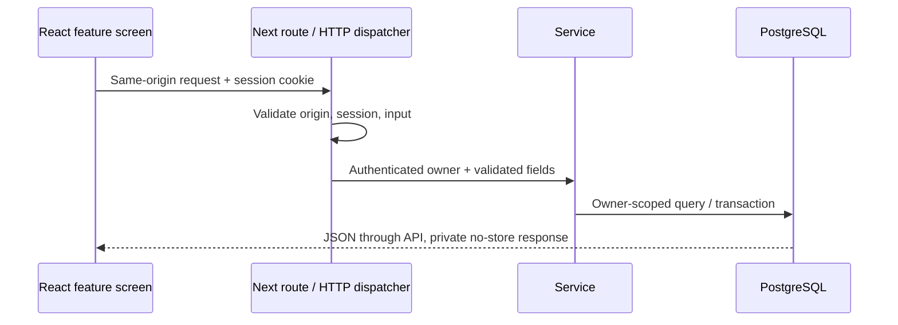

# Architecture

Broke Batman is one Next.js App Router application plus an optional Node mail worker. Both use Prisma against PostgreSQL. The browser never connects directly to the database or receives Google credentials.

## Frontend and HTTP

The persistent application shell owns navigation, bootstrap data, theme, command palette, dialogs, and notifications. Application, inbox, and intelligence screens live in `src/features`; shared controls and smaller screens remain in `components`. Intelligence fetching is separated from skills, company, dashboard, and analytics rendering. Recharts loads dynamically. The shared client displays mutation errors through inline alerts or notifications.

`src/app/api/[...path]/route.ts` exports HTTP handlers. `server/http/router.ts` handles authentication/core endpoints; `intelligence-api.ts` handles Gmail, inbox, skills, notifications, and privacy. This is a small dispatcher, not a separate HTTP framework.

Zod schemas define validation boundaries. Services coordinate application saves/status changes, suggestions, email ingestion, transfers, and intelligence. The application repository centralizes full case includes and owner lookup. Simple handlers query Prisma directly rather than adding redundant repository wrappers.

## Integrations and jobs

| Module                         | Responsibility                                                          |
| ------------------------------ | ----------------------------------------------------------------------- |
| `integrations/job-postings.ts` | Bounded public URL fetching, JSON-LD/text extraction, optional provider |
| `integrations/gmail.ts`        | OAuth/PKCE, exchange/refresh, revocation, validated Google responses    |
| `integrations/token-vault.ts`  | Authenticated token/verifier encryption                                 |
| `jobs/gmail-sync.ts`           | Job claim, lease, pagination, retry, failure notification               |
| `services/email-ingestion.ts`  | Classification, matching, metadata, pending actions, evidence           |
| `services/suggestions.ts`      | Owner checks and transactional approval/dismissal                       |

The worker polls queued or expired-lease jobs every two seconds. `--demo-only` filters selection and execution before provider requests. PostgreSQL queue rows avoid another infrastructure dependency. See [email intelligence](EMAIL_INTELLIGENCE.md) for retry/privacy limits.

## Analytics and operations

Pure calculations live in `lib/analytics.ts`, `lib/search-analytics.ts`, and `lib/skills-intelligence.ts`. `server/services/intelligence.ts` assembles owner-scoped records, signals, weekly comparisons, company groups, and notifications. Historical reach uses status history; response-time averages exclude unfinished observations; source recommendations require minimum samples. Match scores normalize known requirements and show contributing weights. They are descriptive, not hiring predictions.

Vitest tests logic and PostgreSQL transactions. Playwright tests browser workflows. CI starts PostgreSQL, deploys migrations, runs checks/tests/build, then Chromium against production plus a demo worker.

`scripts/start.mjs` starts the standalone build and copies static/public assets. Docker has a non-root runtime image; execution is unverified locally. Deployment needs HTTPS, persistent storage, independent secrets, backups, and a supervised worker for Gmail.
