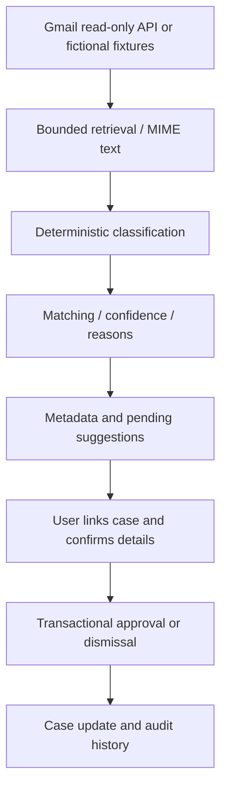

# Email intelligence

Finding a message and approving a change are different operations.

## Setup

For fictional mail, run `npm run mail:worker -- --demo-only`, then **Preferences → Batcomputer Integrations → Try fictional inbox demo**. Examples are labeled demo; no Google account is accessed. Cases use DC-inspired fictional companies. Inbox fixtures also include fictional messages referencing real employers to exercise matching and may need manual case linking.

Real Gmail requires a Google OAuth web client. Set `GOOGLE_CLIENT_ID`, `GOOGLE_CLIENT_SECRET`, `APP_URL`, and a separate 32-byte hex `GMAIL_TOKEN_KEY`. Register exactly `APP_URL/api/gmail/oauth/callback` as the redirect URI. Add your account as a test user if the consent project is in testing, then connect in Preferences. Run `npm run mail:worker` only when you intend to process connected accounts.

The scope is [`gmail.readonly`](https://developers.google.com/workspace/gmail/api/auth/scopes). Public use of this restricted scope can require Google verification/additional review. Live consent and real mailbox access remain unverified; mocked provider exchanges are tested.

## Retrieval and retries

OAuth uses owner-bound, expiring, single-use state and S256 PKCE. Tokens/verifiers are encrypted. Tokens refresh shortly before expiry; revoked access requests reconnection. Disconnect attempts revocation before deleting local credentials, OAuth attempts, and sync state.

Sync searches the last 90 days for application/interview/recruiter/assessment/offer terms, with pages of at most 25 messages. Responses are validated; MIME text is decoded and HTML converted to text. Bodies are processed transiently; attachments are not fetched. The query can miss unusual wording or retrieve unrelated mail before classification rejects it.

A PostgreSQL update claims queued jobs with a two-minute lease. Page tokens checkpoint progress. Transient errors retry with capped exponential backoff, up to five attempts; authorization failures need reconnection. Sync status and persistent notifications expose failures. Jobs run sequentially; large-scale scheduling and long-running lease renewal are not implemented.

## Classification and review

Rules classify confirmations, interviews, assessments, rejections, offers, and recruiter outreach. Matching combines normalized company/role terms, known contacts, and sender/domain evidence. Ambiguous evidence leaves the case unlinked; confidence and reasons remain visible. These are heuristics, not calibrated probabilities.

Users can link cases manually. Suggested status/interview/contact/reminder actions remain pending until approval. Interview details are confirmed because dates/timezones can be ambiguous. Payloads are validated at mutation time. Approval checks ownership, atomically claims the pending action, updates the case, and records evidence. Replay is rejected. Dismissal applies no suggested change.

## Privacy

Stored metadata includes sender, subject, timestamp, identifiers, a maximum 240-character excerpt, classification, matching reasons, suggestions, and related activity/notifications. **Excerpts can still contain sensitive information.** Full bodies, attachments, and provider headers are not persisted. Emails are not sent to the optional job-posting extraction provider.

Disconnect stops sync but preserves metadata. Separate deletion removes email metadata, suggestions, Gmail activity, and notifications; the broader option also removes cases and personal skills/profile. Connection locking prevents in-flight sync from recreating deleted metadata. No automatic expiry policy exists.

Code: [OAuth](../src/server/integrations/gmail.ts), [sync](../src/server/jobs/gmail-sync.ts), [ingestion](../src/server/services/email-ingestion.ts), [matching](../src/lib/email-intelligence.ts), [approval](../src/server/services/suggestions.ts).
